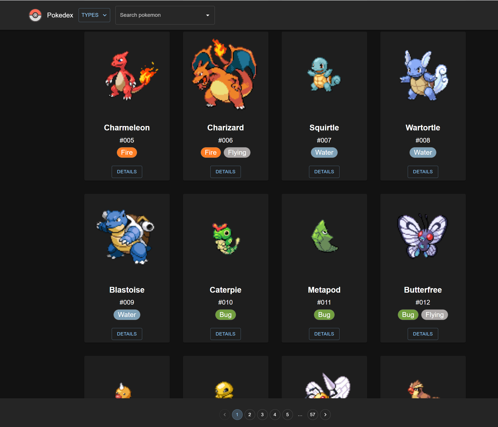
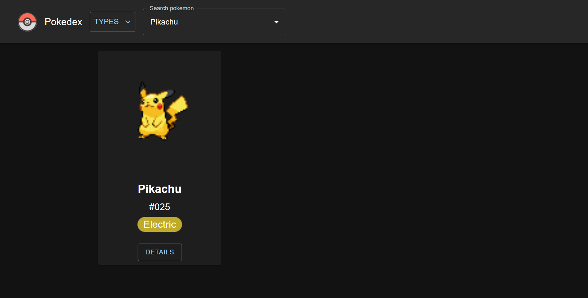
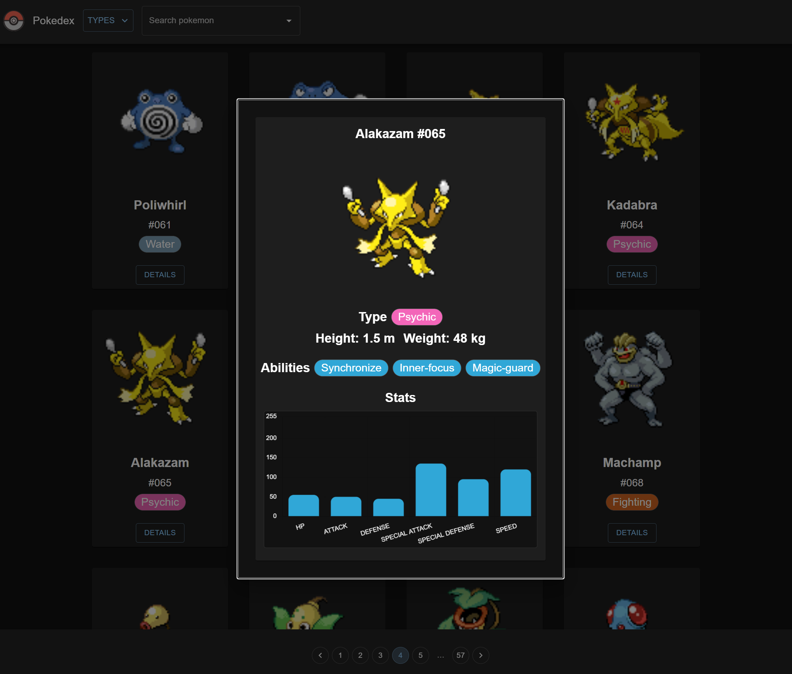

# `Pokedex`

Project was created with React and Material UI

## `Pokemon API`

link: https://pokeapi.co/

### `Steps`

- Install all packages using command: `npm i` or `npm install`

- Run using command: `npm start`

- Open [http://localhost:3000](http://localhost:3000) to view it in the browser.

## `Main`

## `Search`

## `Details`

